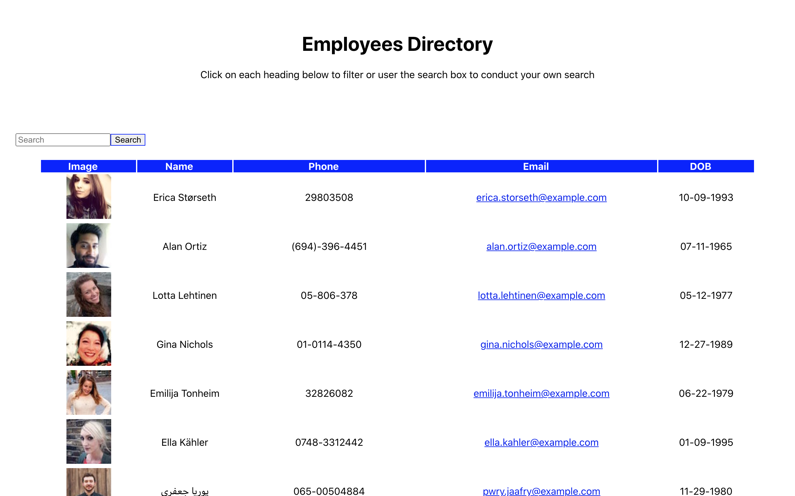
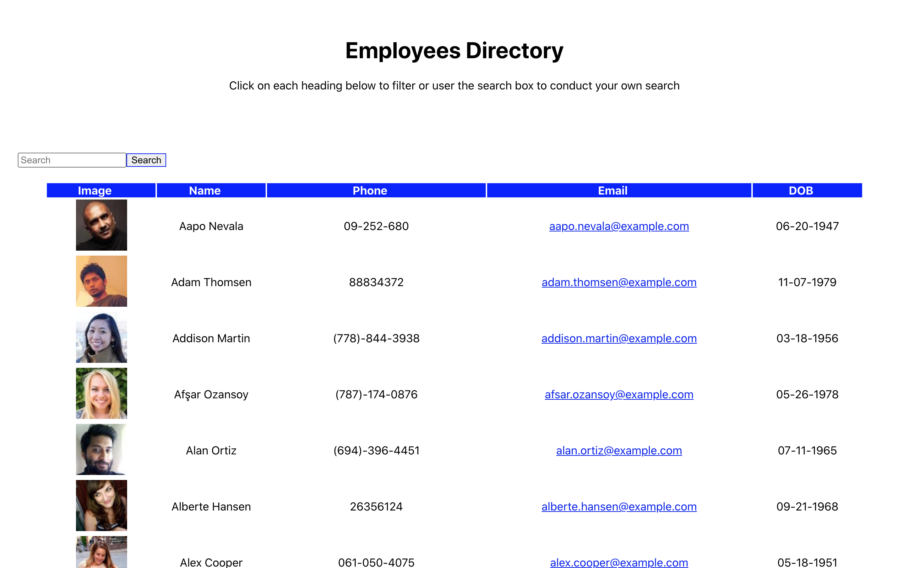
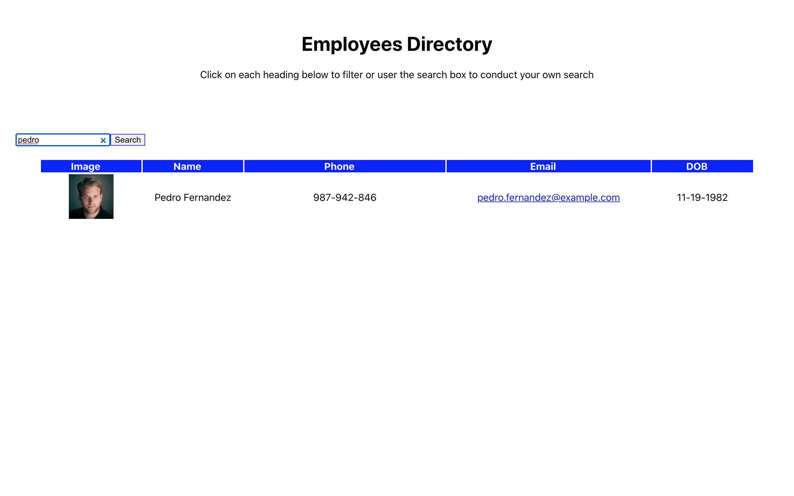

<h1 align="center">Employee Directory</h1>

## Description
  For this assignment, you'll I a employee directory with React. It required to break up the application's UI into components, manage component state, and respond to user events. An employee or manager you would benefit greatly from being able to view non-sensitive data about other employees. It would be particularly helpful to be able to filter employees by name.

  * Sort the table by name and phone number.

  * Filter the users by typing in a search name.

  

  

## User Story

## Table Of Contents
- [Description](#discriptionOfProject)
- [Installation](#installationOfProject)
- [Usage](#usageOfProject)
- [License](#licenseOfProject)
- [Test](#testOfProject)
- [Issues](#issuesOfProject)
- [Contributors](#contributorsOfProject)

## Installation
  
## Usage
  To help employers keep better recored information at their fingertips. [Employee Directory](hhttps://calm-wildwood-23470.herokuapp.com/)

## License
  

## Test
  N/A

## Issues
  Issues were only that i had was that arrays were populating into the console but were not rendering on to the page and getting the React app to deploy to github.

## Contributors
  Myself, Michael Griffith

## Github
  GriffMike167

## Email
  griffithcmichael@gmail.com
